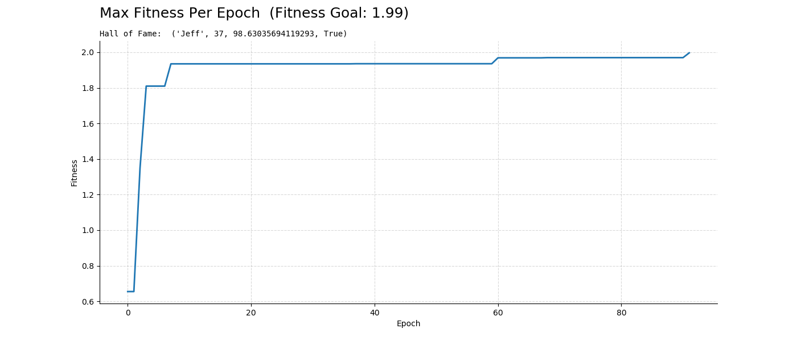

# Tunafish
## Autotuner For Python Functions
Tunafish is an autotuner for plain ol' Python functions. Under the hood, it uses genetic algorithms to determine which arguments maximize a function's return value (i.e. it's fitness); however, Tunafish eliminates the need to think about genetic algorithms. Instead, you can focus more on just writing code.

To use Tunafish, your objective function must satisfy the following two
conditions:
1. Arguments *must* be annotated as primitives types, like `float`,
`int`, `str`, and `bool`, `typing.Text`, etc.
2. The return value *must* be expressed as a single `float` (i.e. a fitness
value).

## Example: Automated Trading
Consider a function whose objective is to place orders to buy and sell stocks. The input arguments are `aggression`, which regulates the a minimum amount of time between orders, and `window`, which determines how far back the trading algorithm should looks when deciding when take action. The return value is simply the net gain or loss generated while trading, which is used as a proxy for fitness.

### Define The Objective Function
```python
from example_project import create_trader, load_historical_trading_data

trader = create_trader()
training_data = load_historical_trading_data(start, stop, interval)

def trade(aggression: float, window: int) -> float:
  gains = trader.trade(training_data, aggression, window)
  return gains  # AKA fitness
```

### Tune it...
```python
from tunafish import FunctionTuner

tuner = FunctionTuner()
arguments = tuner.tune(trade, options={
  'aggression': {'min': 0.01, 'max': 1.0},
  'window': {'min': 5, 'max': 20}
})
```

## More Examples
Working examples can be found in `tunafish.examples`. The "basic" and "early_stopping" examples differ only in that "early_stopping" shows you how to control a bit more of the internals of the genetic algorithm. In particular, we tell it to exit the training loop early if we reach a fitness goal before all 500 epochs have run. Running these examples should generate a plot, showing convergence of fitness versus time.



### Running Examples
Just do `python -m tunafish.examples.basic`!